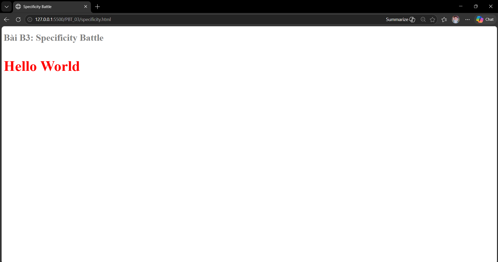

# Phần A: Kiểm tra đọc hiểu
## Câu A1:
**Có 3 cách nhúng CSS vào HTML**
1. Inline CSS (Nhúng trực tiếp vào thẻ HTML)
- Ví dụ code: 
Đoạn văn này màu xanh

- Ưu điểm: Nhanh gọn, không cần tạo thêm file hay tìm thẻ 
</head>
- Ưu điểm: Gom toàn bộ CSS của trang vào một chỗ (phần <head>), giúp HTML bên dưới sạch sẽ hơn Inline. Có thể áp dụng một quy tắc cho nhiều thẻ cùng lúc (ví dụ: đổi màu toàn bộ thẻ 
 trong trang).
- Nhược điểm: Không thể chia sẻ các đoạn code CSS này cho những trang HTML khác. File HTML vẫn bị dài ra đáng kể nếu code CSS quá nhiều.
- Khi nào nên dùng: Phù hợp khi bạn làm một Landing Page đơn giản chỉ có đúng 1 file HTML duy nhất, hoặc khi code template cho Email Marketing (do nhiều ứng dụng đọc mail không hỗ trợ External CSS).

3. External CSS (Liên kết với file .css bên ngoài)
- Ví dụ code:
HTML
<head>
    <link rel="stylesheet" href="styles.css">
</head>
- Ưu điểm: Đây là tiêu chuẩn vàng. HTML và CSS được tách biệt hoàn toàn. Bạn chỉ cần viết CSS một lần trong file styles.css và có thể dùng chung cho hàng trăm trang HTML khác nhau. Trình duyệt cũng sẽ lưu bộ nhớ đệm (cache) file CSS này, giúp website tải nhanh hơn ở những lần truy cập sau.
- Nhược điểm: Trình duyệt phải mất thêm một yêu cầu mạng (HTTP request) để tải file CSS này về trước khi có thể hiển thị trang web đẹp đẽ.
- Khi nào nên dùng: Gần như 100% trong các dự án thực tế và môi trường production
* Nếu cùng 1 element có cả 3 cách CSS đồng thời áp dụng, thì Inline CSS thắng: Trong trường hợp xảy ra xung đột (cùng một thuộc tính như color nhưng mỗi cách lại đặt một màu khác nhau), trình duyệt sẽ quyết định dựa trên hai quy tắc cốt lõi của CSS: Specificity (Độ ưu tiên) và Cascading (Thứ tự ưu tiên). *

1. Quy tắc Specificity (Độ ưu tiên của Selector)
Trình duyệt chấm điểm mức độ "áp sát" của code CSS đối với phần tử HTML:
Inline CSS (Thắng tuyệt đối): Vì được viết trực tiếp vào thẻ HTML (style="..."), nó được coi là có mức độ ưu tiên cao nhất. Trình duyệt hiểu rằng đây là chỉ thị cụ thể nhất cho phần tử đó.
ID, Class, và Tag Selectors: Sau Inline CSS, trình duyệt mới xét đến điểm số của các bộ chọn trong Internal và External CSS (ID > Class > Tag).

2. Quy tắc Cascading (Thứ tự dòng chảy/Thác nước)
Nếu gạt Inline CSS sang một bên, chỉ xét giữa Internal CSS (thẻ <style>) và External CSS (file .css riêng), thì cách nào được trình duyệt đọc sau cùng sẽ thắng.
Thông thường, thẻ <style> và thẻ <link> đều nằm trong phần <head>.
Nếu bạn đặt thẻ <link> ở trên và thẻ <style> ở dưới, thì Internal CSS sẽ thắng (vì nó ghi đè lên những gì đã đọc trước đó).
Ngược lại, nếu thẻ <style> nằm trên và thẻ <link> nằm dưới, thì External CSS sẽ thắng.

3. Trường hợp ngoại lệ: !important
Dù Inline CSS có mạnh đến đâu, nó vẫn sẽ bị đánh bại bởi một dòng code ở External hoặc Internal CSS nếu dòng đó có gắn từ khóa !important.

Ví dụ: color: blue !important; sẽ ghi đè lên cả style="color: red;"

## Câu A2:
1. h1 -> Chọn: ShopTLU
Giải thích: Chọn tất cả các thẻ <h1> có trong trang.
2. .price -> Chọn: 25.990.000đ và 45.990.000đ
Giải thích: Chọn tất cả các phần tử có thuộc tính class="price".
3. #app header -> Chọn: Toàn bộ khối nội dung bên trong <header> (bao gồm: ShopTLU, Home, Products, About)
Giải thích: Chọn thẻ <header> nằm bên trong phần tử có id="app".
4. nav a:first-child -> Chọn: Home
Giải thích: Chọn thẻ <a> đầu tiên nằm trong thẻ <nav>.
5. .product.featured h2 -> Chọn: MacBook Pro
Giải thích: Chọn thẻ <h2> nằm bên trong phần tử có đồng thời hai class là product và featured.
6. article > p -> Chọn: 25.990.000đ, Mô tả sản phẩm... (của iPhone 16) và 45.990.000đ, Mô tả sản phẩm... (của MacBook Pro).
Giải thích: Chọn tất cả các thẻ 
 là con trực tiếp của thẻ <article>. Tổng cộng có 4 thẻ 
 thỏa mãn.
7. a[href="/"] -> Chọn: Home
Giải thích: Chọn thẻ <a> có giá trị thuộc tính href chính xác là /.
8. .top-bar.dark h1 -> Chọn: ShopTLU
Giải thích: Chọn thẻ <h1> nằm trong phần tử có cả hai class top-bar và dark.
** Kiểm chứng đáp án **
- Thẻ <h1> (ShopTLU) bị bao bởi viền đỏ gạch đứt (selector 1) và chữ bị đổi thành màu vàng nghiêng (selector 8).
- Thẻ <header> (selector 3) có viền xanh dương đậm bao quanh.
- Chữ Home vừa được viết hoa (selector 4) vừa có nền xanh lá nhạt (selector 7).
- Các thẻ mô tả và giá đều có vạch tím bên trái do selector 6 (article > p), đồng thời giá tiền có thêm nền vàng do selector 2 (.price).
- Chữ MacBook Pro chuyển thành màu cam và có gạch chân nhờ selector 5 (.product.featured h2).

## Câu A3:
**Trường hợp 1: content-box (mặc định)**
.box-1 {
    width: 400px;
    padding: 20px;
    border: 5px solid black;
    margin: 10px;
}
→ Chiều rộng hiển thị = 450px (Phép tính: 400 + 20*2 + 5*2)
→ Không gian chiếm trên trang = 470px (Phép tính: 450 + 10*2)

**Trường hợp 2: border-box**
.box-2 {
    box-sizing: border-box;
    width: 400px;
    padding: 20px;
    border: 5px solid black;
    margin: 10px;
}
→ Chiều rộng hiển thị = 400px (Bằng đúng giá trị width đã đặt)
→ Kích thước content thực tế = 350px (Phép tính: 400 - 20*2 - 5*2)
→ Không gian chiếm trên trang = 420px (Phép tính: 400 + 10*2)

**Trường hợp 3: Margin collapse**
.box-a { margin-bottom: 25px; }
.box-b { margin-top: 40px; }
→ Khoảng cách giữa box-a và box-b = 40px (Phép tính: Max(25, 40))
→ Giải thích tại sao KHÔNG PHẢI 65px: Vì theo quy tắc Margin Collapse của CSS, khi 2 thẻ block nằm xếp chồng lên nhau theo chiều dọc, margin của chúng không được cộng dồn (không phải lấy 25 + 40). Trình duyệt sẽ gộp chúng lại và lấy giá trị lớn hơn.

**Nếu .box-a có margin-bottom: -10px và .box-b có margin-top: 40px, khoảng cách = 30px**
Giải thích: Khi một margin dương gặp một margin âm, CSS không lấy giá trị lớn hơn nữa mà sẽ cộng trực tiếp hai giá trị đó lại với nhau (phép cộng đại số).
Phép tính: 40 + (-10) = 30px.

## Câu A4
1. Tính specificity score (ID, Class, Tag):
Rule A (p): (0, 0, 1) — 1 Thẻ
Rule B (.price): (0, 1, 0) — 1 Class
Rule C (#main-price): (1, 0, 0) — 1 ID
Rule D (p.price): (0, 1, 1) — 1 Class, 1 Thẻ
2. Element sẽ có màu gì? Giải thích:
Màu: Đỏ (red)
Giải thích: Rule C có điểm Specificity cao nhất là (1, 0, 0) vì nó sử dụng ID selector. Do đó, nó "thắng" và ghi đè tất cả các rule khác
3. Nếu thêm 
:
Màu: Cam (orange).
Giải thích: Inline CSS (viết trực tiếp bằng thuộc tính style="...") có độ ưu tiên cao hơn tất cả các ID, Class hay Tag selector thông thường.
4. Nếu Rule A thêm !important (ví dụ: color: black !important;):
Màu: Đen (black)
Giải thích: Từ khóa !important phá vỡ mọi quy tắc tính điểm Specificity và ép trình duyệt phải nhận giá trị này, đè lên cả ID lẫn Inline CSS

# Phần B: Thực hành code
## Câu B1: 
**Liệt kê 5 loại CSS Selector đã sử dụng trong file style.css:**
1. **Element Selector (Thẻ HTML):**
   - `body { ... }` (Chọn thẻ body)
   - `header { ... }` (Chọn thẻ header)
2. **Class Selector (Lớp):**
   - `.active { ... }` (Chọn phần tử có class là "active" - dùng cho link đang chọn)
3. **ID Selector (Định danh):**
   - `#vetoi { ... }`, `#kynang { ... }` (Chọn thẻ có id tương ứng để tạo margin dưới)
4. **Descendant Selector (Bộ chọn phần tử con):**
   - `nav a { ... }` (Chọn tất cả các thẻ `<a>` nằm bên trong thẻ `<nav>`)
   - `thead tr { ... }` (Chọn thẻ `<tr>` nằm trong `<thead>`)
5. **Pseudo-class Selector (Lớp giả):**
   - `nav a:hover { ... }` (Trạng thái khi di chuột lên link)
   - `tr:nth-child(even) { ... }` (Chọn các dòng số chẵn trong bảng để làm hiệu ứng Zebra striping)
   - `tr:hover { ... }` (Hiệu ứng khi di chuột lên dòng của bảng)

## Câu B3:

**1. Liệt kê 10 rules + Specificity score (Từ thấp đến cao):**
1. `*` -> Specificity: (0,0,0) - Màu: Xám
2. `p` -> Specificity: (0,0,1) - Màu: Nâu
3. `.text` -> Specificity: (0,1,0) - Màu: Hồng
4. `p.text` -> Specificity: (0,1,1) - Màu: Cam
5. `.text.highlight` -> Specificity: (0,2,0) - Màu: Vàng
6. `p.text.highlight` -> Specificity: (0,2,1) - Màu: Xanh lá
7. `#demo` -> Specificity: (1,0,0) - Màu: Xanh lơ (Cyan)
8. `p#demo` -> Specificity: (1,0,1) - Màu: Xanh dương (Blue)
9. `#demo.text` -> Specificity: (1,1,0) - Màu: Tím
10. `p#demo.text.highlight` -> Specificity: (1,2,1) - Màu: Đỏ

**2. Element cuối cùng hiển thị màu gì? Tại sao?**
- Element cuối cùng hiển thị màu **Đỏ (Red)**.
- Tại sao: Vì rule số 10 (`p#demo.text.highlight`) có điểm Specificity cao nhất là (1,2,1) — bao gồm 1 ID, 2 Class và 1 Thẻ (Tag). Trình duyệt luôn ưu tiên áp dụng CSS của rule có điểm số cao nhất, đánh bại và gạch bỏ tất cả các màu của 9 rule còn lại.

**3. Ảnh chụp kết quả màn hình (Screenshot):**

**4. Thay đổi thứ tự rules trong CSS file. Kết quả có đổi không? Giải thích.**
- Kết quả KHÔNG THAY ĐỔI. Chữ vẫn giữ màu Đỏ.
- Giải thích: Quy tắc Cascading (Thứ tự dòng chảy từ trên xuống dưới) chỉ được áp dụng khi hai đoạn code CSS có điểm specificity. Ở bài này, điểm Specificity của rule số 10 đang lớn hơn hẳn tất cả các rules khác, nên dù có cắt nó đem lên để ở dòng trên cùng của file CSS nó vẫn hiện màu đỏ

# Phần C: Debug & suy luận
## Câu C1:
1. Tính chiều rộng thực tế (khi dùng content-box)
Trong chế độ mặc định content-box, width chỉ là kích thước của vùng lõi. Để ra được kích thước hộp chiếm dụng trên màn hình, ta phải cộng thêm cả Padding và Border.
Sidebar:Chiều rộng thực = width (300) + padding (202) + border (12) = 300 + 40 + 2 = 342px
Content:Chiều rộng thực = width (660) + padding (302) + border (12) = 660 + 60 + 2 = 722px

2. Giải thích tại sao layout bị vỡ
Tổng kích thước 2 cột: 342px + 722px = 1064px
Kích thước của vùng chứa (Container): Chỉ có 960px
Lý do vỡ: Hai cột cộng lại (1064px) đã vượt quá sức chứa của container (960px). Vì không đủ chỗ để đứng cạnh nhau trên cùng một hàng ngang, thuộc tính float: left sẽ tự động đẩy cột thứ 2 (Content) rớt xuống dòng bên dưới.

3. Đưa ra 2 cách sửa
Cách 1: Sử dụng border-box (Cách hiện đại, khuyên dùng)
Ta thêm box-sizing: border-box; cho cả 2 cột. Lúc này trình duyệt sẽ ép Padding và Border ăn ngược vào trong lõi. Kích thước thật của Sidebar sẽ đúng bằng 300px và Content đúng bằng 660px. (300 + 660 = vừa khít 960px).

Cách 2: Tính toán lại width thủ công (Cách cổ điển)
Ta giữ nguyên content-box mặc định, nhưng phải tự trừ hao kích thước width bằng tay:
Sidebar mới: width: 258px (Bởi vì 258 + 40 đệm + 2 viền = 300)
Content mới: width: 598px (Bởi vì 598 + 60 đệm + 2 viền = 660)

## Câu C2: 
1. "Sản phẩm A" (<h2 class="title highlight"> trong #featured)
font-size = 20px.
Giải thích: Thẻ này chịu ảnh hưởng của tính kế thừa từ .container (14px) và được target trực tiếp bởi rule .card .title { font-size: 20px; }. Trong CSS, style target trực tiếp luôn thắng style kế thừa
color = green
Giải thích: Thẻ này có 2 rule target màu sắc trực tiếp là #featured .title { color: red; } (điểm specificity là 1,1,0) và .highlight { color: green !important; } (điểm specificity là 0,1,0). Mặc dù rule ID có điểm cao hơn, nhưng từ khóa !important là quyền lực tuyệt đối, phá vỡ mọi quy tắc xếp hạng. Do đó màu xanh lá (green) chiến thắng

2. "Mô tả sản phẩm" (
 trong #featured)
color = blue
Giải thích: Thẻ này được target trực tiếp bởi rule .card p { color: inherit; }. Giá trị inherit ra lệnh cho thẻ 
 phải lấy đúng màu của phần tử cha gần nhất. Cha của nó là 
. Khối .card này đang được áp dụng rule .card { color: blue; }. Vì vậy, thẻ 
 sẽ lấy màu xanh dương (blue) từ cha của nó

3. "Sản phẩm B" (<h2 class="title"> trong thẻ .card thứ hai)
font-size = 20px
Giải thích: Tương tự Sản phẩm A, nó được target trực tiếp bởi rule .card .title { font-size: 20px; }.
color = blue
Giải thích: Không có rule nào target trực tiếp màu sắc cho thẻ <h2> này. Do đó, theo nguyên lý Kế thừa (Inheritance), nó sẽ đi tìm phần tử cha gần nhất có set màu để "xin" màu. Cha của nó là .card có color: blue;. Vậy nó sẽ có màu xanh dương

4. "Mô tả sản phẩm B" (
)
color = green
Giải thích: Thẻ này chịu sự cạnh tranh của 2 rule trực tiếp: .card p { color: inherit; } và .highlight { color: green !important; }. Tương tự Sản phẩm A, sự xuất hiện của !important sẽ đè bẹp tất cả. Màu xanh lá (green) chiến thắng